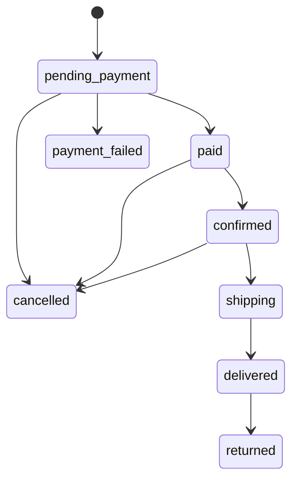
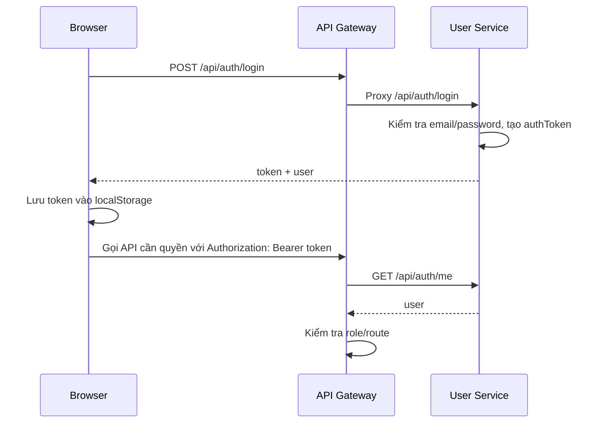
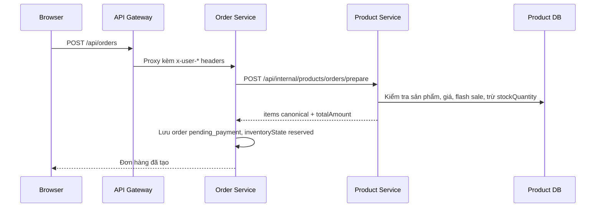
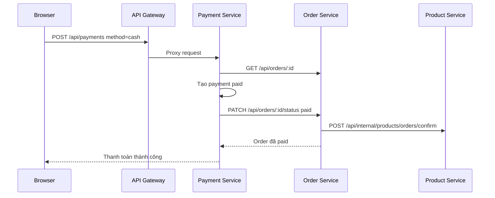
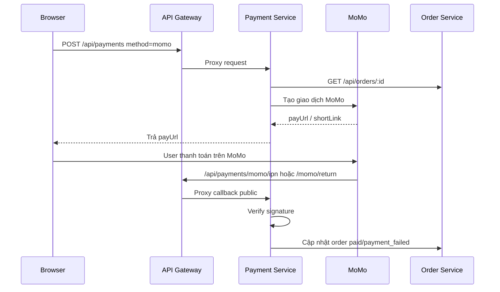

# Tài liệu kiến trúc hệ thống

Tài liệu này tổng hợp kiến trúc, vai trò từng service, luồng nghiệp vụ chính và các ghi chú vận hành của hệ thống microservice trong repository này.

## 1. Tổng quan hệ thống

Hệ thống là một ứng dụng thương mại điện tử/ShopOnline được tách thành các service riêng theo miền nghiệp vụ:

- `fe`: frontend server phục vụ HTML/CSS/JS tĩnh.
- `api-gateway`: cổng vào duy nhất cho browser, thực hiện CORS, rate limit, xác thực và phân quyền trước khi proxy request.
- `user-service`: quản lý tài khoản, đăng ký/đăng nhập, Google OAuth, quên mật khẩu, admin user management.
- `product-service`: quản lý catalog sản phẩm, danh mục, ảnh upload, tồn kho, flash sale.
- `order-service`: tạo đơn hàng, giữ/hoàn/xác nhận tồn kho, quản lý trạng thái đơn hàng.
- `payment-service`: tạo giao dịch thanh toán, xử lý MoMo callback/IPN, ghi nhận tiền mặt, đối soát và hoàn tiền.

Mỗi service nghiệp vụ có MongoDB riêng, dùng mô hình "database per service". Giao tiếp giữa các service hiện tại là HTTP đồng bộ qua nội bộ Docker network.

## 2. Sơ đồ kiến trúc

+------------------------------------------------------------------------+
|                      LỚP TRÌNH DUYỆT & GIAO DIỆN                       |
|                                                                        |
|    +------------------------+          +--------------------------+    |
|    |   🌐 Browser Client    | --------> |   🖥️ fe (Static Server)  |    |
|    +------------------------+          |         Port :3004       |    |
+-----------------|----------------------+--------------------------+
                  | (Gọi API HTTP)
                  v
+------------------------------------------------------------------------+
|                             LỚP CỔNG VÀO                               |
|                                                                        |
|            +-----------------------------------------------+           |
|            |              🛡️ api-gateway (:3000)            |           |
|            |       (CORS | Rate Limit | Auth Proxy)        |           |
|            +-----------------------------------------------+           |
+---------------------------------|--------------------------------------+
         +------------------------+-------------------+----------------+
         | /api/auth              | /api/products     | /api/orders    | /api/payments
         v                        v                   v                v
+--------|------------------------|-------------------|----------------|---------+
|        |                        |                   |                |         |
|  +-----v----------+      +------v-----------+  +----v-----------+  +-v-------+ |
|  |🔑 user-service |      |📦 product-service|  |🛒 order-service|  |💳 payment| |
|  |   Port :3005   |      |   Port :3001     |  |   Port :3002   |  | -service | |
|  +--------|-------+      +------^-----------+  +----^-------|---+  +----|----+ |
|           |                     |                   |       |           |      |
|           |                     +---(HTTP Đồng bộ)--+       +--(HTTP)---+      |
|           |                          Giữ/Đặt kho              Cập nhật         |
|           |                                                    Order           |
|     LỚP DỊCH VỤ LÕI (MICROSERVICES)                                            |
+-----------|-----------------------------|-------------------|-----------|------+
            |                             |                   |           |
            v                             v                   v           v
+-----------|-----------------------------|-------------------|-----------|------+
|     +-----v------+                +-----v------+      +-----v------+  +-v--------+ |
|     |🗄️ user-db  |                |🗄️ product-db|      |🗄️ order-db |  |🗄️ payment| |
|     | (MongoDB)  |                | (MongoDB)  |      | (MongoDB)  |  |   -db    | |
|     +------------+                +------------+      +------------+  +----------+ |
|                                                                                    |
|                           LỚP LƯU TRỮ DỮ LIỆU                                      |
+------------------------------------------------------------------------------------+

### Cổng và endpoint nội bộ

| Thành phần | Port | Vai trò |
| --- | ---: | --- |
| `api-gateway` | `3000` | Public API, proxy request đến các service |
| `fe` | `3004` | Static frontend server |
| `product-service` | `3001` | Catalog, danh mục, tồn kho, upload ảnh |
| `order-service` | `3002` | Đơn hàng và đồng bộ tồn kho |
| `payment-service` | `3003` | Thanh toán, MoMo, đối soát, hoàn tiền |
| `user-service` | `3005` | Tài khoản, xác thực, phân quyền |
| `mailpit` | `8025` | Web UI xem email dev |

## 3. Luồng request tổng quát

[🌐 BROWSER]          [🛡️ API GATEWAY]        [🔑 USER SERVICE]      [📦 TARGET SERVICE]
     |                       |                       |                      |
     |--- 1. Gửi Request --->|                       |                      |
     |    (/api/... + Token) |                       |                      |
     |                       |--- 2. Xác thực Me --->|                      |
     |                       |    (Bearer Token)     |                      |
     |                       |                       |                      |
     |                       |<-- 3. Trả về User ----|                      |
     |                       |    (ID, Email, Role)  |                      |
     |                       |                                              |
     |                       |-- [Hộp kiểm tra bảo mật]                     |
     |                       |   - Kiểm tra Token hợp lệ?                   |
     |                       |   - Khớp Role với Route?                     |
     |                       |   - Có bị Rate Limit không?                  |
     |                       |-- (Nếu SAI -> Trả lỗi 401/403 về Browser)    |
     |                       |                                              |
     |                       |--- 4. Chuyển tiếp Request (Proxy) ---------->|
     |                       |    (Gắn kèm Header: x-user-id, x-user-role)  |
     |                       |                                              |
     |                       |                                              |-- [Xử lý logic]
     |                       |                                              |   - Đọc x-user-id
     |                       |                                              |   - Thao tác DB
     |                       |                                              |
     |                       |<-- 5. Trả về Kết quả nghiệp vụ --------------|
     |                       |       (Dữ liệu JSON thô)                     |
     |                       |                                              |
     |<-- 6. Phản hồi -------|                                              |
     |    (Clean Response)   |                                              |

Gateway là lớp bảo vệ chính cho public API. Các route public như xem catalog được đi qua không cần đăng nhập; các route tạo đơn, thanh toán, admin CRUD sẽ cần user hợp lệ hoặc role `admin`.

## 4. Chức năng từng service

### 4.1 Frontend (`fe`)

Chức năng chính:

- Phục vụ các trang HTML tĩnh: home, categories, cart, payment, payment-result, login, register, reset-password, account, admin-products.
- Quản lý giỏ hàng bằng `localStorage`.
- Gọi API qua `http://localhost:3000` đến `api-gateway`.
- Lưu phiên đăng nhập ở client bằng token/user trong `localStorage`.
- Trang admin gồm quản lý sản phẩm, danh mục, đơn hàng, thanh toán, đối soát, user.
- Trang account cho người dùng cập nhật hồ sơ, đổi mật khẩu, xem đơn hàng và hủy đơn đang chờ thanh toán.

File liên quan:

- `fe/src/app.js`: cấu hình Express static server.
- `fe/src/routes/pages.js`: map route đến các trang HTML.
- `fe/public/js/auth.js`: quản lý phiên đăng nhập và điều hướng theo quyền.
- `fe/public/js/script.js`: storefront, catalog, cart.
- `fe/public/js/payment.js`: checkout, tạo order và payment.
- `fe/public/js/admin-products.js`: admin dashboard.
- `fe/public/js/account.js`: trang tài khoản và đơn hàng của user.

### 4.2 API Gateway (`api-gateway`)

Chức năng chính:

- Public entrypoint cho browser tại port `3000`.
- Cấu hình CORS theo `FRONTEND_URL` và `CORS_ORIGINS`.
- Rate limit theo nhóm route:
  - `/api/auth`: giới hạn request đăng nhập/đăng ký.
  - `/api/payments`: giới hạn request thanh toán.
  - `/api`: giới hạn API chung.
- Proxy:
  - `/api/auth` -> `user-service`
  - `/api/users` -> `user-service`
  - `/api/products` -> `product-service`
  - `/uploads` -> static upload của `product-service`
  - `/api/orders` -> `order-service`
  - `/api/payments` -> `payment-service`
- Xác thực token bằng cách gọi `user-service /api/auth/me`.
- Gắn các header người dùng cho service đích:
  - `x-user-id`
  - `x-user-email`
  - `x-user-full-name`
  - `x-user-role`
- Gắn header nội bộ cho `product-service`:
  - `x-internal-service-token`
  - `x-internal-service`

Phân quyền tại gateway:

- Sản phẩm:
  - `GET /api/products` public.
  - Mutation sản phẩm/danh mục và đọc dữ liệu đã xóa yêu cầu admin.
- Đơn hàng:
  - `POST /api/orders`, `/api/orders/my`, hủy đơn của mình yêu cầu user đăng nhập.
  - Quản lý tất cả đơn hàng yêu cầu admin, trừ request nội bộ từ payment-service.
- Thanh toán:
  - MoMo return/IPN public.
  - Tạo thanh toán yêu cầu user đăng nhập.
  - Danh sách, đối soát, hoàn tiền yêu cầu admin.
- User management:
  - `/api/users` yêu cầu admin.

### 4.3 User Service (`user-service`)

Chức năng chính:

- Đăng ký tài khoản local.
- Đăng nhập local bằng email/password.
- Đăng nhập Google OAuth.
- Cấp token đăng nhập dạng opaque token lưu trong MongoDB (`authToken`), không phải JWT.
- Endpoint `/api/auth/me` trả về user từ Bearer token.
- Đăng xuất bằng cách xóa `authToken`.
- Quên mật khẩu:
  - Tạo token reset ngẫu nhiên.
  - Lưu hash của reset token.
  - Gửi email reset qua SMTP/Mailpit.
  - Reset mật khẩu và vô hiệu hóa token đăng nhập cũ.
- Cập nhật thông tin cá nhân và đổi mật khẩu.
- Admin quản lý user:
  - Liệt kê user.
  - Cập nhật họ tên/vai trò.
  - Xóa user.
  - Bảo vệ để không tự hạ quyền admin đang đăng nhập hoặc xóa admin cuối cùng.
- Bootstrap admin mặc định khi service khởi động.

Endpoint chính:

| Method | Path | Chức năng |
| --- | --- | --- |
| `POST` | `/api/auth/register` | Đăng ký |
| `POST` | `/api/auth/login` | Đăng nhập |
| `GET` | `/api/auth/google` | Bắt đầu Google OAuth |
| `GET` | `/api/auth/google/callback` | Nhận callback Google OAuth |
| `POST` | `/api/auth/forgot-password` | Yêu cầu email reset password |
| `POST` | `/api/auth/reset-password` | Đặt lại mật khẩu |
| `GET` | `/api/auth/me` | Lấy user hiện tại |
| `PATCH` | `/api/auth/me` | Cập nhật hồ sơ user hiện tại |
| `POST` | `/api/auth/logout` | Đăng xuất |
| `GET` | `/api/users` | Admin liệt kê user |
| `PATCH` | `/api/users/:id` | Admin cập nhật user |
| `DELETE` | `/api/users/:id` | Admin xóa user |

Dữ liệu chính:

- `users`: `fullName`, `email`, `passwordHash`, `passwordSalt`, `role`, `provider`, `googleId`, `avatarUrl`, `authToken`, reset password metadata, login metadata.

### 4.4 Product Service (`product-service`)

Chức năng chính:

- Quản lý catalog sản phẩm.
- Quản lý danh mục sản phẩm.
- Upload và phục vụ ảnh sản phẩm từ `/uploads`.
- Tìm kiếm, lọc, sắp xếp, phân trang sản phẩm.
- Soft delete sản phẩm bằng `isDeleted`.
- Quản lý tồn kho:
  - `stockQuantity`
  - `soldCount`
  - `trangThai`
- Quản lý flash sale:
  - Giá sale.
  - Thời gian bắt đầu/kết thúc.
  - Giới hạn tồn flash sale.
  - Giới hạn mỗi đơn.
  - Số lượng đã giữ/bán trong flash sale.
- Cung cấp API nội bộ cho `order-service` để giữ kho, hoàn kho, xác nhận bán.
- Bootstrap dữ liệu mẫu và sync danh mục từ sản phẩm khi khởi động.

Endpoint public/admin:

| Method | Path | Chức năng |
| --- | --- | --- |
| `GET` | `/api/products` | Lấy danh sách sản phẩm, lọc/sắp xếp/phân trang |
| `GET` | `/api/products/:id` | Lấy chi tiết sản phẩm |
| `POST` | `/api/products` | Admin tạo sản phẩm |
| `PUT` | `/api/products/:id` | Admin cập nhật sản phẩm |
| `PATCH` | `/api/products/:id/status` | Admin cập nhật trạng thái |
| `PATCH` | `/api/products/:id/stock` | Admin cập nhật tồn kho |
| `DELETE` | `/api/products/:id` | Admin soft delete sản phẩm |
| `GET` | `/api/products/categories` | Danh sách tên danh mục public |
| `GET` | `/api/products/categories/browse` | Danh mục kèm thông tin storefront |
| `GET` | `/api/products/categories/manage` | Admin quản lý danh mục |
| `POST` | `/api/products/categories` | Admin tạo danh mục |
| `PUT` | `/api/products/categories/:id` | Admin cập nhật danh mục |
| `DELETE` | `/api/products/categories/:id` | Admin ẩn/xóa vĩnh viễn danh mục |

Endpoint nội bộ cho order-service:

| Method | Path | Chức năng |
| --- | --- | --- |
| `POST` | `/api/internal/products/orders/prepare` | Kiểm tra sản phẩm, tính giá canonical, trừ tồn kho tạm thời |
| `POST` | `/api/internal/products/orders/release` | Hoàn tồn kho khi đơn bị hủy/thất bại/quá hạn |
| `POST` | `/api/internal/products/orders/confirm` | Tăng `soldCount` khi đơn đã thanh toán |

Dữ liệu chính:

- `products`: tên, giá, image, mô tả, danh mục, categoryId, trạng thái, stockQuantity, soldCount, brand, tags, flashSale, isDeleted, audit user.
- `product_categories`: name, slug, description, isActive, sortOrder, audit user.

### 4.5 Order Service (`order-service`)

Chức năng chính:

- Tạo đơn hàng cho user đã đăng nhập.
- Gọi `product-service` để giữ tồn kho và lấy lại item canonical với giá/tình trạng flash sale tại thời điểm đặt hàng.
- Lưu thông tin người mua, người nhận, items, tổng tiền, trạng thái thanh toán/giao hàng.
- Quản lý trạng thái đơn hàng với state transition rõ ràng.
- Đồng bộ tồn kho theo trạng thái:
  - `paid`: xác nhận số lượng bán.
  - `cancelled`, `payment_failed`, `returned`: hoàn kho nếu chưa hoàn.
- Cho user xem đơn của mình và hủy đơn đang `pending_payment`.
- Cho admin xem/cập nhật/xóa đơn hàng.
- Worker quét đơn quá hạn thanh toán, chuyển sang `cancelled` và hoàn kho.

Endpoint chính:

| Method | Path | Chức năng |
| --- | --- | --- |
| `POST` | `/api/orders` | Tạo đơn hàng |
| `GET` | `/api/orders` | Admin hoặc payment-service nội bộ lấy danh sách đơn |
| `GET` | `/api/orders/my` | User lấy đơn của mình |
| `GET` | `/api/orders/:id` | Lấy chi tiết đơn nếu có quyền |
| `PATCH` | `/api/orders/:id/status` | Admin/payment-service cập nhật trạng thái |
| `PATCH` | `/api/orders/:id/cancel` | User hủy đơn của mình |
| `DELETE` | `/api/orders/:id` | Admin xóa đơn |

Trạng thái đơn hàng:



Dữ liệu chính:

- `orders`: user, items, customerInfo, totalAmount, status, inventoryState, paymentMethod, paymentId, transactionId, expiresAt, status metadata, delivery metadata.

### 4.6 Payment Service (`payment-service`)

Chức năng chính:

- Tạo thanh toán cho đơn hàng đang `pending_payment`.
- Hỗ trợ method:
  - `cash`: ghi nhận thanh toán tiền mặt và cập nhật order sang `paid`.
  - `momo`: tạo giao dịch MoMo, lưu payUrl/shortLink, đợi callback/IPN.
- Xác thực chữ ký MoMo bằng HMAC SHA-256.
- Xử lý MoMo return/IPN:
  - Thành công: update order sang `paid`, lưu `transactionId`, `paidAt`.
  - Thất bại: update order sang `payment_failed`, lưu `failedAt`.
- Liệt kê thanh toán cho admin.
- Đối soát thanh toán với order:
  - Phát hiện payment paid nhưng order chưa paid.
  - Phát hiện payment failed nhưng order vẫn pending.
  - Phát hiện payment pending quá lâu.
  - Cơ chế `repair` cho một số lệch có thể sửa tự động.
- Hoàn tiền sau khi order đã ở trạng thái `returned`.

Endpoint chính:

| Method | Path | Chức năng |
| --- | --- | --- |
| `GET` | `/api/payments` | Admin lấy danh sách thanh toán |
| `POST` | `/api/payments` | Tạo payment cash/MoMo |
| `POST` | `/api/payments/momo/ipn` | MoMo IPN |
| `GET` | `/api/payments/momo/return` | MoMo browser redirect |
| `POST` | `/api/payments/reconcile` | Admin đối soát/thực hiện repair |
| `PATCH` | `/api/payments/:id/refund` | Admin ghi nhận hoàn tiền |

Dữ liệu chính:

- `payments`: orderId, momoOrderId, requestId, amount, method, transactionId, status, payUrl, shortLink, momo response/notification, paid/failed/refund metadata.

## 5. Luồng nghiệp vụ quan trọng

### 5.1 Đăng nhập và xác thực



### 5.2 Tạo đơn hàng và giữ tồn kho



Nếu tạo đơn thất bại sau khi đã giữ một phần kho, `order-service` sẽ gọi release để rollback tồn kho.

### 5.3 Thanh toán tiền mặt



### 5.4 Thanh toán MoMo



### 5.5 Hủy đơn và đơn quá hạn thanh toán

- User có thể hủy đơn đang `pending_payment`.
- Worker trong `order-service` chạy theo `ORDER_EXPIRATION_SWEEP_INTERVAL_MS`.
- Đơn `pending_payment` quá `expiresAt` sẽ bị chuyển sang `cancelled` với lý do `payment_timeout`.
- Worker gọi `product-service` để hoàn tồn kho.
- Nếu hoàn kho lỗi, lỗi được lưu vào `inventorySyncError` để lần quét sau thử lại.

## 6. Bảo mật và phân quyền

### Cơ chế xác thực

- Token đăng nhập là opaque token được lưu trong `users.authToken`.
- Client gửi `Authorization: Bearer <token>`.
- Gateway gọi `user-service /api/auth/me` để xác minh token trước các route cần quyền.
- User service không dùng JWT trong luồng hiện tại, dù package `jsonwebtoken` có trong gateway.

### Cơ chế phân quyền

- Role hiện có: `customer`, `admin`.
- Gateway kiểm tra admin cho route quản trị.
- `product-service` không tin request admin trực tiếp; service này yêu cầu:
  - Header nội bộ hợp lệ từ gateway.
  - Actor có role admin trong `x-user-role`.
- Giao tiếp nội bộ service-to-service dùng `x-internal-service-token` và `x-internal-service`.

### Rate limiting

- Rate limiter được cài trong gateway bằng in-memory `Map`.
- Cách này phù hợp local/dev hoặc single instance.
- Nếu scale nhiều instance gateway, nên chuyển sang Redis/shared store để rate limit đồng nhất.

## 7. Dữ liệu và lưu trữ

Mỗi service sở hữu database riêng:

| Service | Database mặc định | Collection chính |
| --- | --- | --- |
| `user-service` | `revo_user_db` | `users` |
| `product-service` | `revo_product_db` | `products`, `product_categories` |
| `order-service` | `revo_order_db` | `orders` |
| `payment-service` | `revo_payment_db` | `payments` |

Volumes Docker:

- `user_data`: dữ liệu MongoDB user.
- `product_data`: dữ liệu MongoDB product.
- `order_data`: dữ liệu MongoDB order.
- `payment_data`: dữ liệu MongoDB payment.
- `product_uploads`: ảnh upload của sản phẩm.

## 8. Cấu hình môi trường quan trọng

### Chung

| Biến | Ý nghĩa |
| --- | --- |
| `INTERNAL_SERVICE_TOKEN` | Token xác thực nội bộ giữa gateway/service |
| `FRONTEND_URL` | URL frontend, mặc định `http://localhost:3004` |
| `PUBLIC_API_BASE_URL` | URL public của gateway, mặc định `http://localhost:3000` |
| `CORS_ORIGINS` | Danh sách origin được gateway chấp nhận |

### User service

| Biến | Ý nghĩa |
| --- | --- |
| `DEFAULT_ADMIN_EMAIL` | Email admin mặc định |
| `DEFAULT_ADMIN_PASSWORD` | Mật khẩu admin mặc định |
| `GOOGLE_CLIENT_ID` / `GOOGLE_CLIENT_SECRET` | Cấu hình Google OAuth |
| `GOOGLE_REDIRECT_URI` | Callback OAuth |
| `GOOGLE_STATE_SECRET` | Secret ký state OAuth |
| `PASSWORD_RESET_TTL_MINUTES` | Thời hạn reset password |
| `SMTP_HOST`, `SMTP_PORT`, `SMTP_SECURE`, `SMTP_USER`, `SMTP_PASS`, `SMTP_FROM` | Cấu hình gửi email |

### Payment service

| Biến | Ý nghĩa |
| --- | --- |
| `MOMO_ENDPOINT` | Endpoint tạo giao dịch MoMo |
| `MOMO_PARTNER_CODE` | Partner code MoMo |
| `MOMO_ACCESS_KEY` | Access key MoMo |
| `MOMO_SECRET_KEY` | Secret ký request/response MoMo |
| `MOMO_REQUEST_TYPE` | Request type, mặc định `payWithMethod` |
| `MOMO_REDIRECT_URL` | URL return từ MoMo về gateway |
| `MOMO_IPN_URL` | URL IPN từ MoMo về gateway |

### Order service

| Biến | Ý nghĩa |
| --- | --- |
| `ORDER_PAYMENT_TIMEOUT_MINUTES` | Thời gian chờ thanh toán, mặc định 15 phút |
| `ORDER_EXPIRATION_SWEEP_INTERVAL_MS` | Chu kỳ worker quét đơn quá hạn |

## 9. Health check và vận hành

Endpoint health:

- `GET /health` trên gateway.
- `GET /health` trên product-service, có `databaseReady`.
- `GET /health` trên user-service, có `databaseReady`.
- `GET /health` trên order-service.
- `GET /health` trên payment-service.

Khởi động local bằng Docker Compose:

```bash
docker compose up --build
```

URL local thường dùng:

- Frontend: `http://localhost:3004`
- API Gateway: `http://localhost:3000`
- Mailpit UI: `http://localhost:8025`

## 10. Ghi chú thiết kế và điểm cần lưu ý

- Hệ thống đang dùng HTTP đồng bộ giữa service. Luồng order-payment-inventory đã có rollback/repair cơ bản, nhưng chưa có message broker hay distributed transaction.
- `order-service` đóng vai trò điều phối tồn kho khi tạo/hủy/cập nhật đơn.
- `product-service` là nguồn sự thật cho giá sản phẩm, tồn kho và flash sale tại thời điểm đặt hàng.
- `payment-service` là nguồn sự thật cho payment status; `order-service` là nguồn sự thật cho order status.
- Đối soát payment là cơ chế quan trọng để phát hiện lệch giữa `payments` và `orders`.
- Rate limiter hiện tại in-memory, cần nâng cấp nếu chạy nhiều gateway instance.
- Default admin password chỉ nên dùng cho local/dev; môi trường thật cần set lại qua biến môi trường.
- `INTERNAL_SERVICE_TOKEN` mặc định chỉ phù hợp dev; production cần dùng secret mạnh và xoay vòng được.
- Upload ảnh đang lưu volume local `product_uploads`; nếu deploy production nên cân nhắc object storage/CDN.
- MoMo return/IPN là public route, nên việc verify signature trong `payment-service` là bắt buộc và đã được cài đặt.
- Gateway là điểm áp policy chính. Không nên expose trực tiếp các service nghiệp vụ ra internet.

## 11. Hướng phát triển tiếp theo

- Thêm test tích hợp cho các luồng: tạo đơn, thanh toán cash, MoMo success/failure, cancel/expire order, refund.
- Thêm OpenAPI/Swagger cho gateway hoặc từng service.
- Dùng Redis cho rate limit, session/cache nếu scale ngang.
- Thêm correlation id/request id để trace log qua nhiều service.
- Thêm message queue/outbox pattern cho payment/order/inventory nếu cần độ bền cao hơn.
- Thêm centralized logging và metrics.
- Bổ sung migration/versioning schema cho MongoDB khi dữ liệu lớn hơn.
