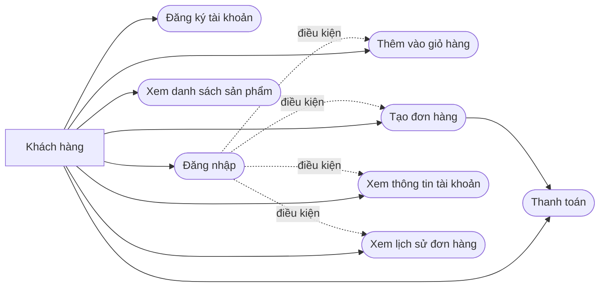
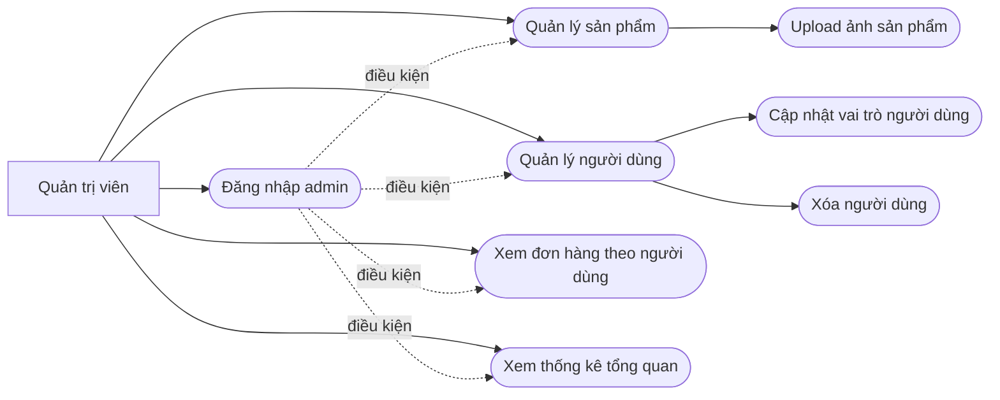
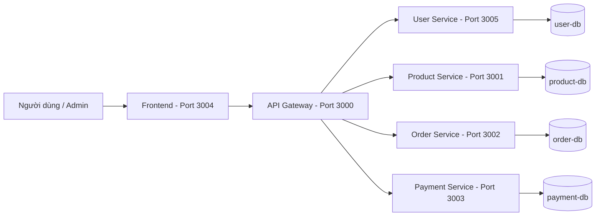
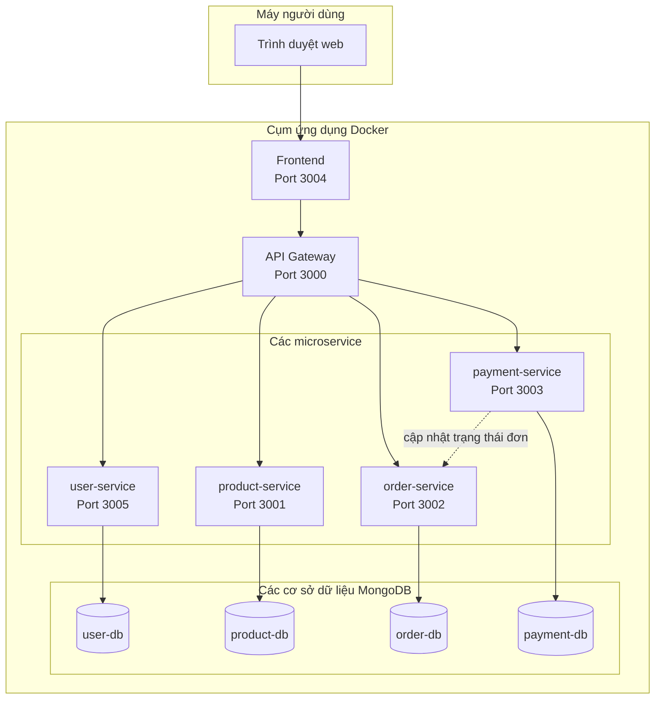
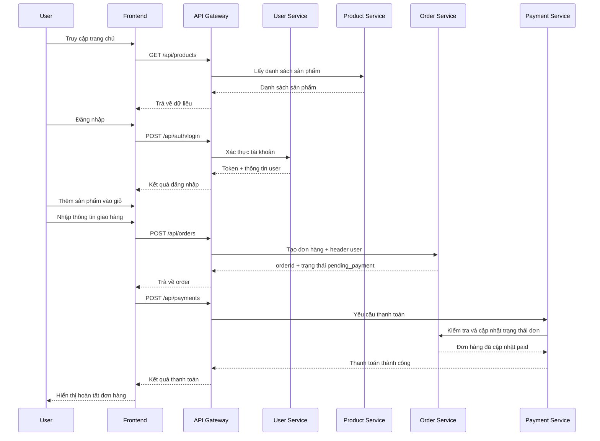
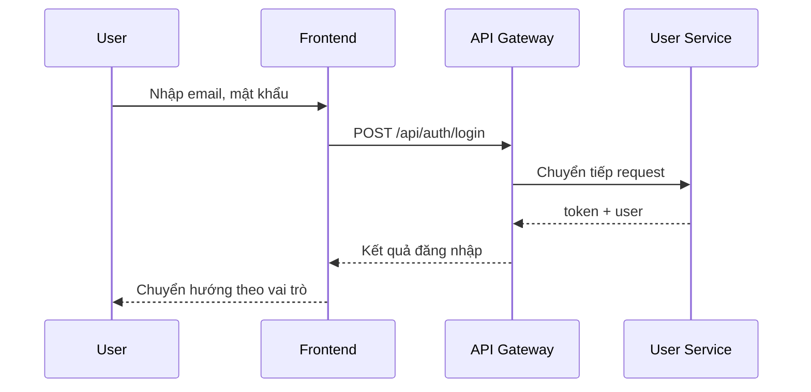
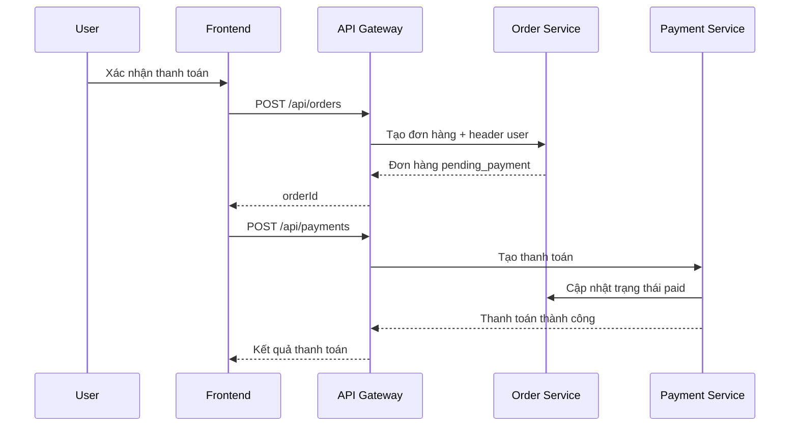
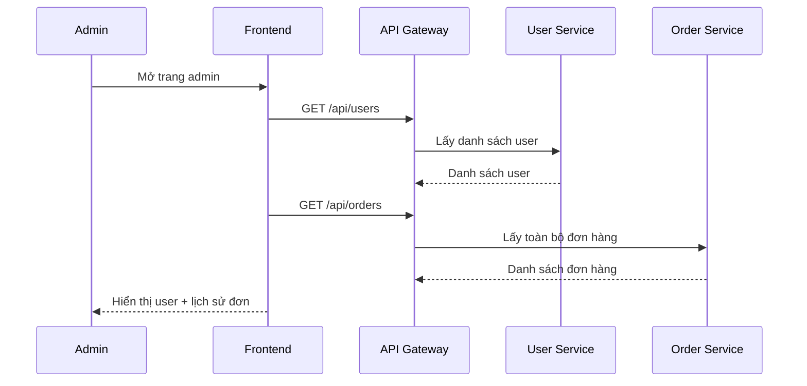
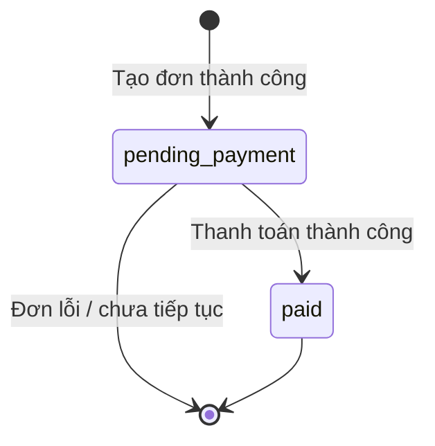

# BÀI TẬP LỚN

**Môn học:** Phát triển phần mềm hướng dịch vụ  
**Đề tài:** Xây dựng hệ thống bán hàng trực tuyến sử dụng kiến trúc Microservices  
**Tên hệ thống:** ShopOnline  
**Công nghệ chính:** Node.js, Express.js, MongoDB, Docker Compose, HTML/CSS/JavaScript  
**Sinh viên thực hiện:** `[Tự điền thông tin nhóm]`  
**Giảng viên hướng dẫn:** `[Tự điền]`  
**Năm học:** `[Tự điền]`

---

## Lời cảm ơn

Nhóm thực hiện xin gửi lời cảm ơn tới giảng viên bộ môn đã hướng dẫn, hỗ trợ và tạo điều kiện để nhóm hoàn thành đề tài. Trong quá trình thực hiện, nhóm đã có cơ hội vận dụng các kiến thức về kiến trúc hướng dịch vụ, tổ chức hệ thống theo mô hình microservices, xây dựng API RESTful, phân tách nghiệp vụ theo dịch vụ độc lập và triển khai hệ thống bằng Docker Compose. Đây là cơ hội quan trọng để nhóm tiếp cận tư duy thiết kế hệ thống hiện đại và thực hành triển khai một ứng dụng gần với nhu cầu thực tế.

---

## PHẦN 1: MỞ ĐẦU

### 1.1. Giới thiệu đề tài

Đề tài tập trung xây dựng một hệ thống bán hàng trực tuyến theo kiến trúc microservices với mục tiêu mô phỏng một cửa hàng online hiện đại. Hệ thống cho phép người dùng xem sản phẩm, đăng ký tài khoản, đăng nhập, thêm sản phẩm vào giỏ hàng, tạo đơn hàng, thanh toán và theo dõi lịch sử mua hàng. Đồng thời, quản trị viên có thể quản lý sản phẩm, người dùng và theo dõi đơn hàng theo từng tài khoản.

Khác với kiến trúc monolithic truyền thống, hệ thống được chia thành nhiều dịch vụ độc lập theo từng nghiệp vụ. Mỗi dịch vụ có phạm vi trách nhiệm riêng, có cơ sở dữ liệu riêng và được kết nối thông qua API Gateway. Cách tiếp cận này giúp hệ thống dễ mở rộng, dễ bảo trì và phù hợp với các ứng dụng thương mại điện tử trong thực tế.

### 1.2. Lý do lựa chọn đề tài

Việc xây dựng hệ thống bán hàng trực tuyến là một bài toán gần gũi, dễ hình dung về mặt nghiệp vụ nhưng vẫn đủ phức tạp để áp dụng các nguyên lý thiết kế hệ thống phân tán. Đề tài này được lựa chọn vì các lý do sau:

- Nhu cầu mua sắm trực tuyến ngày càng phổ biến và là mô hình tiêu biểu trong phát triển phần mềm hiện đại.
- Kiến trúc microservices phù hợp với hệ thống có nhiều nghiệp vụ độc lập như người dùng, sản phẩm, đơn hàng và thanh toán.
- Đề tài giúp nhóm thực hành đầy đủ từ thiết kế dữ liệu, xây dựng API, xác thực người dùng, phân quyền quản trị, đến triển khai hệ thống bằng container.
- Hệ thống có thể mở rộng thêm nhiều tính năng như tìm kiếm nâng cao, thanh toán online, theo dõi vận chuyển, thống kê doanh thu hoặc thông báo tự động.

### 1.3. Mục tiêu đề tài

Mục tiêu chính của đề tài là xây dựng một hệ thống bán hàng trực tuyến hoàn chỉnh theo định hướng microservices. Cụ thể:

- Xây dựng frontend cho người dùng và quản trị viên.
- Tách hệ thống backend thành các dịch vụ độc lập theo nghiệp vụ.
- Cung cấp API RESTful cho từng nhóm chức năng.
- Xây dựng cơ chế xác thực người dùng và phân quyền admin.
- Cho phép người dùng đặt hàng và thanh toán theo luồng hợp lệ.
- Cho phép quản trị viên quản lý sản phẩm, quản lý người dùng và theo dõi đơn hàng.
- Đóng gói toàn bộ hệ thống bằng Docker Compose để dễ chạy và triển khai.

### 1.4. Phạm vi đề tài

Phạm vi triển khai hiện tại của hệ thống bao gồm:

- Quản lý tài khoản người dùng và admin.
- Quản lý sản phẩm có hình ảnh, mô tả, danh mục hiển thị và trạng thái còn hàng/hết hàng.
- Quản lý giỏ hàng phía frontend bằng `localStorage`.
- Tạo đơn hàng theo toàn bộ giỏ hàng.
- Ghi nhận thanh toán và cập nhật trạng thái đơn hàng.
- Trang tài khoản để người dùng xem thông tin cá nhân và lịch sử đơn hàng.
- Trang quản trị để admin quản lý sản phẩm, người dùng và xem đơn hàng theo từng user.

Những chức năng chưa nằm trong phạm vi triển khai đầy đủ gồm:

- Tích hợp cổng thanh toán bên thứ ba.
- Đồng bộ giỏ hàng theo tài khoản trên server.
- Theo dõi vận chuyển và giao hàng theo thời gian thực.
- Gửi email, SMS hoặc thông báo đẩy.
- Giám sát hệ thống, logging tập trung và tracing giữa các dịch vụ.

---

## PHẦN 2: MÔ TẢ BÀI TOÁN

### 2.1. Mô tả tổng quan

Hệ thống ShopOnline được xây dựng nhằm phục vụ hai nhóm đối tượng chính:

- **Người dùng (customer):** đăng ký, đăng nhập, xem sản phẩm, thêm vào giỏ hàng, thanh toán, xem thông tin tài khoản và lịch sử đơn hàng.
- **Quản trị viên (admin):** quản lý sản phẩm, quản lý người dùng và theo dõi lịch sử đơn hàng theo từng tài khoản.

Kiến trúc của hệ thống gồm frontend riêng và nhiều backend service độc lập:

- `fe`: giao diện người dùng và admin.
- `api-gateway`: đầu vào duy nhất cho frontend khi gọi API.
- `user-service`: quản lý tài khoản và xác thực.
- `product-service`: quản lý sản phẩm và upload ảnh.
- `order-service`: quản lý đơn hàng.
- `payment-service`: xử lý thanh toán và cập nhật trạng thái đơn.

### 2.2. Các chức năng chính

#### Chức năng dành cho người dùng

- Đăng ký tài khoản.
- Đăng nhập, đăng xuất.
- Xem danh sách sản phẩm.
- Xem trạng thái còn hàng/hết hàng.
- Thêm sản phẩm vào giỏ hàng khi đã đăng nhập.
- Xác nhận thanh toán với thông tin người nhận hàng.
- Xem hồ sơ tài khoản.
- Xem lịch sử đơn hàng của chính mình.

#### Chức năng dành cho quản trị viên

- Thêm, sửa, xóa sản phẩm.
- Upload ảnh sản phẩm.
- Cập nhật trạng thái sản phẩm.
- Xem danh sách người dùng.
- Tìm kiếm và lọc người dùng theo vai trò.
- Sửa tên và vai trò người dùng.
- Xóa người dùng với các ràng buộc an toàn.
- Xem thống kê tổng quan hệ thống.
- Xem lịch sử đơn hàng của từng người dùng.

### 2.3. Use case chính

#### Use case 1: Đăng ký tài khoản

- **Tác nhân chính:** Người dùng
- **Mục tiêu:** Tạo tài khoản mới để sử dụng hệ thống
- **Tiền điều kiện:** Chưa có tài khoản với email đã nhập
- **Luồng chính:**
  1. Người dùng truy cập trang đăng ký.
  2. Nhập họ tên, email, mật khẩu.
  3. Hệ thống kiểm tra dữ liệu đầu vào.
  4. Nếu hợp lệ, hệ thống tạo tài khoản mới và cấp token đăng nhập.
- **Luồng phụ:** Email đã tồn tại hoặc mật khẩu không hợp lệ.
- **Hậu điều kiện:** Tài khoản được lưu vào `user-service`.

#### Use case 2: Đăng nhập

- **Tác nhân chính:** Người dùng / Admin
- **Mục tiêu:** Truy cập hệ thống với đúng vai trò
- **Tiền điều kiện:** Tài khoản đã tồn tại
- **Luồng chính:**
  1. Người dùng nhập email và mật khẩu.
  2. Hệ thống xác thực thông tin.
  3. Nếu hợp lệ, token được cấp và lưu trên frontend.
  4. Người dùng được chuyển hướng tới trang phù hợp.
- **Hậu điều kiện:** Phiên đăng nhập được thiết lập.

#### Use case 3: Xem sản phẩm và thêm vào giỏ hàng

- **Tác nhân chính:** Người dùng
- **Mục tiêu:** Chọn sản phẩm cần mua
- **Tiền điều kiện:** Sản phẩm tồn tại; muốn thêm vào giỏ thì phải đăng nhập
- **Luồng chính:**
  1. Người dùng truy cập trang chủ.
  2. Hệ thống tải danh sách sản phẩm từ `product-service`.
  3. Người dùng xem thông tin sản phẩm.
  4. Người dùng nhấn thêm vào giỏ hàng.
- **Luồng phụ:** Nếu chưa đăng nhập thì hệ thống chuyển tới trang đăng nhập; nếu sản phẩm hết hàng thì không cho thêm.

#### Use case 4: Tạo đơn hàng và thanh toán

- **Tác nhân chính:** Người dùng
- **Mục tiêu:** Hoàn tất việc đặt hàng
- **Tiền điều kiện:** Đã đăng nhập và giỏ hàng có sản phẩm hợp lệ
- **Luồng chính:**
  1. Người dùng vào giỏ hàng.
  2. Hệ thống kiểm tra lại tính hợp lệ của các sản phẩm.
  3. Người dùng nhập thông tin nhận hàng.
  4. Frontend gửi yêu cầu tạo đơn tới `order-service` qua gateway.
  5. Sau khi đơn được tạo, frontend gửi yêu cầu thanh toán tới `payment-service`.
  6. `payment-service` xác minh số tiền và cập nhật đơn sang trạng thái `paid`.
- **Luồng phụ:** Sản phẩm hết hàng, sai số tiền, hoặc thanh toán trùng.
- **Hậu điều kiện:** Đơn hàng và thanh toán được lưu thành công.

#### Use case 5: Xem lịch sử đơn hàng

- **Tác nhân chính:** Người dùng
- **Mục tiêu:** Theo dõi các đơn đã đặt
- **Tiền điều kiện:** Đã đăng nhập
- **Luồng chính:**
  1. Người dùng vào trang tài khoản.
  2. Frontend gọi `GET /api/orders/my`.
  3. Hệ thống trả về danh sách đơn hàng của user hiện tại.
  4. Giao diện hiển thị trạng thái, số tiền, phương thức thanh toán và danh sách sản phẩm.

#### Use case 6: Quản lý người dùng

- **Tác nhân chính:** Admin
- **Mục tiêu:** Quản lý tài khoản trong hệ thống
- **Tiền điều kiện:** Đăng nhập với vai trò `admin`
- **Luồng chính:**
  1. Admin mở trang quản trị.
  2. Hệ thống tải danh sách user từ `user-service`.
  3. Admin tìm kiếm, chọn user.
  4. Admin chỉnh sửa họ tên, vai trò hoặc xóa user.
- **Ràng buộc:** Không cho admin tự xóa chính mình hoặc hạ quyền admin cuối cùng.

### 2.4. Biểu đồ Use Case của người dùng



### 2.5. Biểu đồ Use Case của quản trị viên



### 2.6. Biểu đồ hoạt động đặt hàng của người dùng

```mermaid
flowchart TD
    start([Bắt đầu])
    browse[Xem sản phẩm]
    auth{Đã đăng nhập?}
    login[Chuyển tới trang đăng nhập]
    addcart[Thêm sản phẩm vào giỏ hàng]
    stock{Sản phẩm còn hàng?}
    cart[Xem giỏ hàng]
    validate[Kiểm tra lại sản phẩm trước khi checkout]
    shipping[Nhập thông tin nhận hàng]
    createOrder[Tạo đơn hàng tại order-service]
    pay[Tạo thanh toán tại payment-service]
    success[Hiển thị thanh toán thành công]
    fail[Thông báo lỗi và cho phép thử lại]
    end([Kết thúc])

    start --> browse --> auth
    auth -- Không --> login --> auth
    auth -- Có --> stock
    stock -- Không --> fail --> end
    stock -- Có --> addcart --> cart --> validate --> shipping --> createOrder --> pay
    pay -->|Thành công| success --> end
    pay -->|Thất bại| fail --> end
```

### 2.7. Biểu đồ hoạt động quản trị người dùng

```mermaid
flowchart TD
    start([Bắt đầu])
    adminLogin[Admin đăng nhập]
    openAdmin[Mở trang quản trị]
    loadUsers[Tải danh sách người dùng]
    selectUser[Chọn một tài khoản]
    action{Thao tác gì?}
    updateUser[Cập nhật họ tên hoặc vai trò]
    deleteUser[Xóa tài khoản]
    constraints{Vi phạm ràng buộc an toàn?}
    saveSuccess[Lưu thay đổi thành công]
    deleteSuccess[Xóa thành công]
    error[Thông báo lỗi]
    viewOrders[Xem lịch sử đơn hàng của user]
    end([Kết thúc])

    start --> adminLogin --> openAdmin --> loadUsers --> selectUser --> action
    action -->|Cập nhật| updateUser --> constraints
    action -->|Xóa| deleteUser --> constraints
    action -->|Xem đơn| viewOrders --> end
    constraints -- Có --> error --> end
    constraints -- Không --> saveSuccess --> end
    deleteUser --> deleteSuccess --> end
```

---

## PHẦN 3: PHÂN TÍCH VÀ THIẾT KẾ HỆ THỐNG

### 3.1. Kiến trúc tổng thể

Hệ thống áp dụng kiến trúc microservices, trong đó mỗi dịch vụ chịu trách nhiệm cho một nghiệp vụ riêng biệt và có cơ sở dữ liệu MongoDB độc lập. Frontend không gọi trực tiếp các service nghiệp vụ mà thông qua `api-gateway`, giúp tập trung hóa xác thực, phân quyền và điều phối request.



### 3.1.1. Biểu đồ triển khai hệ thống



### 3.2. Các dịch vụ trong hệ thống

#### 3.2.1. User Service

`user-service` chịu trách nhiệm quản lý tài khoản người dùng và xác thực phiên đăng nhập.

Các chức năng chính:

- Đăng ký tài khoản
- Đăng nhập
- Đăng xuất
- Lấy thông tin người dùng hiện tại
- Lấy danh sách user dành cho admin
- Cập nhật thông tin user bởi admin
- Xóa user bởi admin

Đặc điểm:

- Mật khẩu được băm bằng `crypto.scrypt`
- Token đăng nhập được sinh ngẫu nhiên và lưu trong MongoDB
- Có seed sẵn tài khoản admin mặc định
- Hỗ trợ phân quyền `customer` và `admin`

#### 3.2.2. Product Service

`product-service` quản lý danh sách sản phẩm và upload hình ảnh.

Các chức năng chính:

- Tạo sản phẩm mới
- Lấy danh sách sản phẩm
- Xem chi tiết sản phẩm
- Cập nhật sản phẩm
- Xóa sản phẩm
- Upload ảnh và lưu vào thư mục `public/uploads`

Thông tin sản phẩm bao gồm:

- Tên sản phẩm
- Giá
- Ảnh
- Mô tả
- Danh mục hiển thị
- Trạng thái còn hàng / hết hàng

#### 3.2.3. Order Service

`order-service` quản lý thông tin đơn hàng.

Các chức năng chính:

- Tạo đơn hàng từ toàn bộ giỏ hàng
- Lấy lịch sử đơn hàng của người dùng hiện tại
- Lấy danh sách toàn bộ đơn hàng cho admin
- Lấy chi tiết một đơn hàng
- Cập nhật trạng thái thanh toán
- Xóa đơn hàng bởi admin

Mỗi đơn hàng lưu các thông tin:

- Chủ sở hữu đơn hàng
- Danh sách sản phẩm
- Thông tin người nhận
- Tổng tiền
- Trạng thái đơn
- Phương thức thanh toán
- Mã giao dịch

#### 3.2.4. Payment Service

`payment-service` chịu trách nhiệm ghi nhận thanh toán và phối hợp với `order-service`.

Luồng xử lý:

1. Nhận `orderId`, `amount`, `method`.
2. Kiểm tra đơn hàng tồn tại.
3. So khớp số tiền với `totalAmount`.
4. Chặn thanh toán trùng.
5. Tạo bản ghi thanh toán.
6. Cập nhật trạng thái đơn hàng thành `paid`.

#### 3.2.5. API Gateway

`api-gateway` là điểm truy cập API duy nhất cho frontend.

Vai trò chính:

- Proxy request tới từng microservice
- Xác thực bearer token
- Phân quyền admin cho các route nhạy cảm
- Gắn thông tin user vào header nội bộ khi gọi `order-service`
- Giới hạn quyền xem đơn hàng theo vai trò

#### 3.2.6. Frontend

Frontend được xây dựng bằng HTML, CSS và JavaScript thuần, tách giao diện thành nhiều trang:

- `index.html`: trang chủ, xem sản phẩm
- `cart.html`: giỏ hàng
- `payment.html`: thanh toán
- `login.html`: đăng nhập
- `register.html`: đăng ký
- `account.html`: tài khoản người dùng
- `admin-products.html`: trang quản trị

### 3.3. Thiết kế dữ liệu

#### User

- `fullName`
- `email`
- `passwordHash`
- `passwordSalt`
- `role`
- `authToken`
- `lastLoginAt`
- `createdAt`

#### Product

- `ten`
- `gia`
- `image`
- `moTa`
- `danhMuc`
- `trangThai`

#### Order

- `user`
- `items`
- `customerInfo`
- `totalAmount`
- `status`
- `paymentMethod`
- `paymentId`
- `transactionId`
- `thoiGian`

#### Payment

- `orderId`
- `amount`
- `method`
- `transactionId`
- `status`
- `createdAt`

### 3.4. Luồng nghiệp vụ chính

#### 3.4.1. Sequence toàn hệ thống



#### 3.4.2. Luồng đăng nhập



#### 3.4.3. Luồng checkout



#### 3.4.4. Luồng admin quản lý user



#### 3.4.5. Biểu đồ trạng thái đơn hàng



---

## PHẦN 4: TRIỂN KHAI HỆ THỐNG

### 4.1. Công nghệ sử dụng

| Thành phần | Công nghệ |
|---|---|
| Frontend | HTML, CSS, JavaScript |
| Backend | Node.js, Express.js |
| Database | MongoDB |
| Upload ảnh | Multer |
| Container hóa | Docker, Docker Compose |
| Reverse proxy API | http-proxy-middleware |
| Xác thực | Bearer token tự sinh, lưu trong MongoDB |

### 4.2. Cấu trúc thư mục chính

```text
soa-nhom6/
├── api-gateway/
├── fe/
│   └── public/
│       ├── css/
│       ├── js/
│       └── pages/
├── order-service/
├── payment-service/
├── product-service/
├── user-service/
└── docker-compose.yml
```

### 4.3. Cấu hình Docker Compose

Hệ thống hiện gồm các container sau:

- `product-db` tại cổng `27018`
- `order-db` tại cổng `27020`
- `payment-db` tại cổng `27019`
- `user-db` tại cổng `27021`
- `product-service` tại cổng `3001`
- `order-service` tại cổng `3002`
- `payment-service` tại cổng `3003`
- `fe` tại cổng `3004`
- `user-service` tại cổng `3005`
- `api-gateway` tại cổng `3000`

Lệnh chạy hệ thống:

```bash
docker compose up --build
```

### 4.4. Các URL chính để sử dụng

#### Frontend

- `http://localhost:3004/`
- `http://localhost:3004/cart.html`
- `http://localhost:3004/payment.html`
- `http://localhost:3004/login.html`
- `http://localhost:3004/register.html`
- `http://localhost:3004/account.html`
- `http://localhost:3004/admin-products.html`

#### API Gateway

- `http://localhost:3000/api/auth/register`
- `http://localhost:3000/api/auth/login`
- `http://localhost:3000/api/auth/me`
- `http://localhost:3000/api/products`
- `http://localhost:3000/api/orders`
- `http://localhost:3000/api/payments`
- `http://localhost:3000/api/users`

### 4.5. Tài khoản admin mặc định

- **Email:** `admin@shoponline.local`
- **Mật khẩu:** `Admin@123`

---

## PHẦN 5: KIỂM THỬ VÀ ĐÁNH GIÁ

### 5.1. Các chức năng đã hoàn thành

- Đăng ký, đăng nhập, đăng xuất.
- Phân quyền admin và customer.
- Xem sản phẩm và upload ảnh sản phẩm.
- Giỏ hàng và chặn mua khi chưa đăng nhập.
- Tạo đơn hàng cho toàn bộ giỏ hàng.
- Thanh toán và cập nhật trạng thái đơn hàng.
- Trang tài khoản người dùng.
- Trang quản trị sản phẩm.
- Trang quản trị người dùng và xem đơn hàng theo user.

### 5.2. Ưu điểm của hệ thống

- Kiến trúc tách dịch vụ rõ ràng, dễ phát triển tiếp.
- Dễ chạy cục bộ nhờ Docker Compose.
- Có phân quyền tương đối rõ giữa user và admin.
- Có giao diện riêng cho người dùng và quản trị viên.
- Luồng đơn hàng và thanh toán đã được tách đúng hơn so với cách xử lý trực tiếp trên frontend.

### 5.3. Hạn chế

- Chưa dùng JWT chuẩn; phiên đăng nhập đang dựa trên token lưu trong database.
- Giỏ hàng vẫn lưu trên `localStorage`, chưa đồng bộ theo tài khoản.
- Chưa có tìm kiếm sản phẩm nâng cao hoặc bộ lọc server-side.
- Chưa tích hợp cổng thanh toán thật.
- Chưa có service riêng cho danh mục sản phẩm.
- Chưa có logging tập trung, rate limiting, monitoring hoặc circuit breaker.

### 5.4. Hướng phát triển

- Đồng bộ giỏ hàng theo tài khoản.
- Tích hợp thanh toán thực tế như VNPay, MoMo hoặc Stripe.
- Tách thêm `category-service` nếu cần mở rộng.
- Thêm chức năng cập nhật trạng thái đơn hàng từ phía admin.
- Bổ sung dashboard doanh thu và thống kê nâng cao.
- Thêm email xác nhận đơn hàng và thông báo trạng thái.
- Chuẩn hóa xác thực bằng JWT + refresh token.

---

## KẾT LUẬN

Đề tài đã xây dựng được một hệ thống bán hàng trực tuyến hoạt động theo mô hình microservices với các thành phần chính gồm frontend, API Gateway, user-service, product-service, order-service và payment-service. Hệ thống đáp ứng được các luồng nghiệp vụ cơ bản của một cửa hàng online: quản lý tài khoản, xem sản phẩm, thêm giỏ hàng, tạo đơn, thanh toán và quản trị dữ liệu.

Điểm nổi bật của đề tài là việc phân tách rõ ràng các nghiệp vụ thành những dịch vụ độc lập, giúp tăng tính mở rộng, dễ bảo trì và tạo tiền đề để phát triển thành hệ thống lớn hơn trong tương lai. Mặc dù vẫn còn một số hạn chế như chưa có cổng thanh toán thực, chưa đồng bộ giỏ hàng theo user và chưa triển khai đầy đủ hạ tầng giám sát, hệ thống hiện tại đã đạt được mục tiêu học thuật và kỹ thuật cốt lõi của đề tài.

---

## PHỤ LỤC: Gợi ý thông tin cần tự điền trước khi nộp

- Tên trường, khoa, học phần
- Tên giảng viên hướng dẫn
- Danh sách thành viên nhóm
- Mã sinh viên
- Ngày hoàn thành báo cáo
- Ảnh chụp giao diện hệ thống
- Biểu đồ use case, activity, sequence nếu muốn trình bày đầy đủ hơn trong bản nộp cuối
